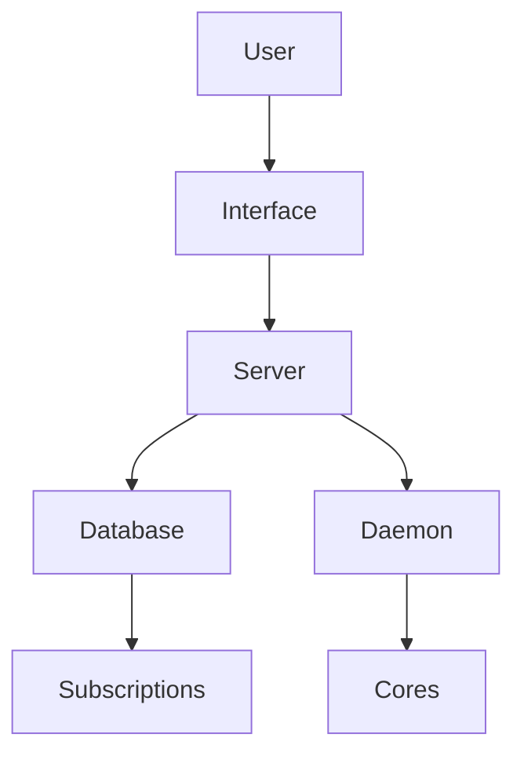
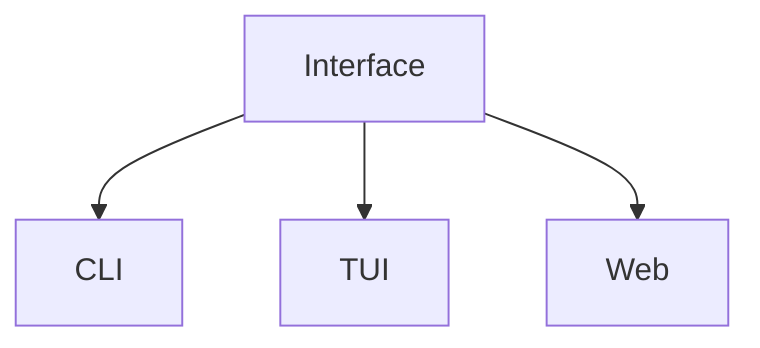
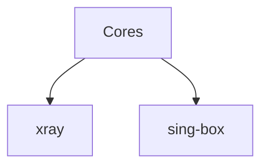

# Architecture

```mermaid
flowchart TD
  u[User] --> i[Interface]
  i --> s[Server]
  s --> db[Database]
  db --> ss[Subscriptions]
  s --> d[Daemon]
  d --> c[Cores]
```

```mermaid
flowchart TD
  i[Interface] --> c[CLI]
  i --> t[TUI]
  i --> w[Web]
```

```mermaid
flowchart TD
   c[Cores] --> x[xray]
   c --> s[sing-box]
```
